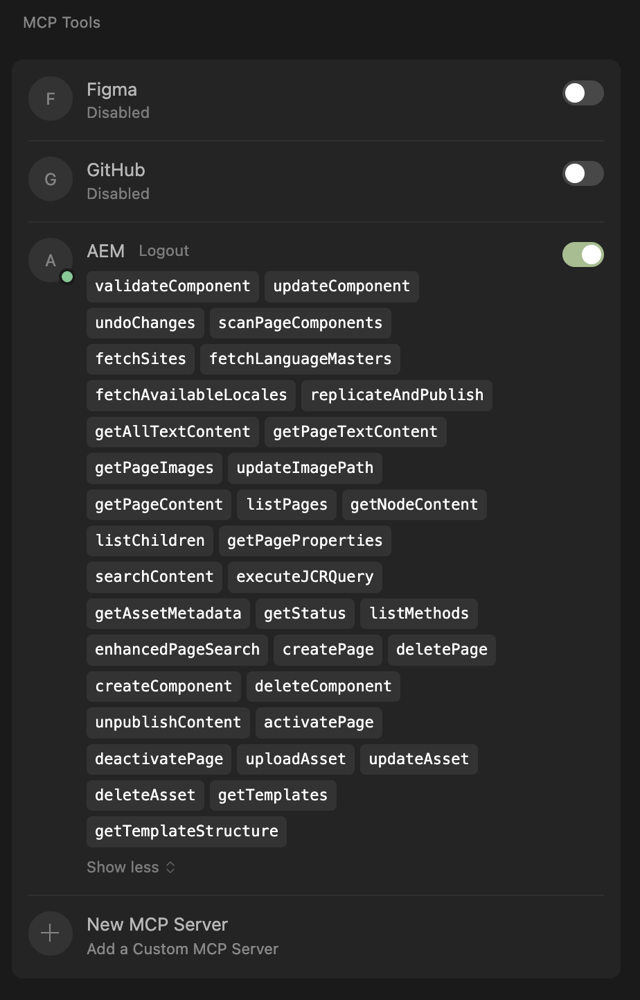

# AEM MCP Server (aem-mcp-server)

[](https://npmjs.org/package/aem-mcp-server)
[](https://github.com/easingthemes/aem-mcp-server/actions/workflows/release.yml)
[](https://github.com/easingthemes/aem-mcp-server/actions)
[](https://github.com/semantic-release/semantic-release)
[](LICENSE)

AEM MCP Server is a full-featured Model Context Protocol (MCP) server for Adobe Experience Manager (AEM). 
It provides a simple integration with any AI Agent.
This project is designed for non-technical persons who want to manage AEM via natural language.

---

## Overview

- **Chat with your AEM instance** for content, component, and asset operations.
- **AI IDEs integration** (Cursor, Copilot, Webstorm, VS Code, etc.)
- **Supports both AEMaaCS and self-hosted instances**
- **Modern, TypeScript-based AEM MCP server**
- **REST/JSON-RPC API** with latest MCP features.

---

## Quick Start

### Prerequisites
- Node.js 18+
- Access to an AEM instance (local or remote)

### Installation
```sh
npm install aem-mcp-server -g
```

### Start the Server
With default settings (admin:admin credentials for http://localhost:4502):
```sh
aem-mcp
```

### Configuration
```
Options:
      --version  Show version number                                   [boolean]
  -H, --host                         [string] [default: "http://localhost:4502"]
  -u, --user                                         [string] [default: "admin"]
  -p, --pass                                         [string] [default: "admin"]
  -i, --id       clientId                                 [string] [default: ""]
  -s, --secret   clientSecret                             [string] [default: ""]
  -m, --mcpPort                                         [number] [default: 8502]
  -h, --help     Show help                                             [boolean]
```

For AEMaaCS, use the `clientId` and `clientSecret` for authentication. [More info](https://developer.adobe.com/developer-console/docs/guides/authentication/ServerToServerAuthentication/implementation).
For self-hosted AEM use user/pass. The default credentials are `admin:admin`.

### Example Command
```sh
aem-mcp -u=user@domain.com -p=mypass -H=https://author-qa.adobeaemcloud.com
```

### Add AEM MCP to AI IDE
[](https://cursor.com/en/install-mcp?name=AEM&config=eyJ1cmwiOiJodHRwOi8vMTI3LjAuMC4xOjg1MDIvbWNwIn0%3D)

---

## Features

- **AEM Page & Asset Management**: Create, update, delete, activate, deactivate, and replicate pages and assets
- **Component Operations**: Validate, update, scan, and manage AEM components (including Experience Fragments)
- **Advanced Search**: QueryBuilder, fulltext, fuzzy, and enhanced page search
- **Replication & Rollout**: Publish/unpublish content, roll out changes to language copies
- **Text & Image Extraction**: Extract all text and images from pages, including fragments
- **Template & Structure Discovery**: List templates, analyze page/component structure
- **JCR Node Access**: Legacy and modern node/content access
- **AI/LLM Integration**: Natural language interface for AEM via OpenAI, Anthropic, Ollama, or custom LLMs
- **Security**: Auth, environment-based config, and safe operation defaults

---

## AI IDE Integration (Cursor, Copilot, etc.)

AEM MCP Server is compatible with modern AI IDEs and code editors that support MCP protocol, such as **Cursor** and **Copilot** (eg in WebStorm or VS Code).

### How to Connect:
1. **Install and run the AEM MCP Server** as described above.
2. **Configure your IDE** to connect to the MCP server:
   - Open your IDE's MCP server settings.
   - Add a new server with:
     - **Type:** Custom MCP
     - **url:** `http://127.0.0.1:8502/mcp`

3. **Restart your IDE** if needed. The IDE will now be able to:
   - List, search, and manage AEM content
   - Run MCP methods (CRUD, search, rollout, etc.)

Sample for AI-based code editors or custom clients:

```json
{
  "mcpServers": {
    "AEM": {
      "url": "http://127.0.0.1:8502/mcp"
    }
  }
}
```



## Usage

```
List all components on MyPage
```

## API Documentation

For detailed API documentation, please refer to the [API Docs](docs/API.md).

## Similar Projects

- https://github.com/indrasishbanerjee/aem-mcp-server (Used as a base for this project)
- https://www.npmjs.com/package/@myea/aem-mcp-handler (Looks like an original source of the above project)
